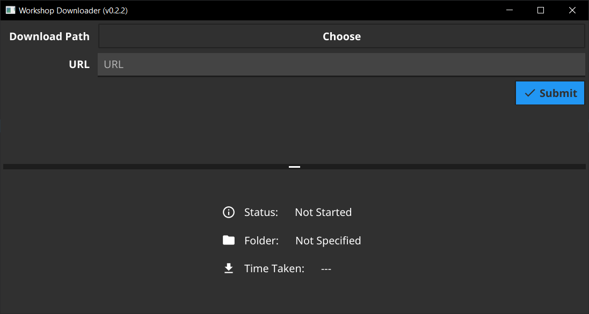

# WorkshopDownloader

# [DOWNLOAD](https://github.com/NeutronX-dev/WorkshopDownloader/releases/download/v0.2.2/windows.WorkshopDownloader.exe) (v0.2.2)

# How does it work?
When you input a URL such as `https://steamcommunity.com/sharedfiles/filedetails/?id=1111111111` it will download it from steam (using [Steam Workshop Downloader](https://steamworkshopdownloader.io/) API) into the current folder as a ZIP. And it will decompress the contents into the desired folder before deleting the remaining ZIP.

# Information
This program may need **Administrative Permissions** (Run as Admin) to be able to access folder that are being used by other programs. Otherwise it will prompt and error saying "No Permission" or it will not allow you to browse the the desired folder.